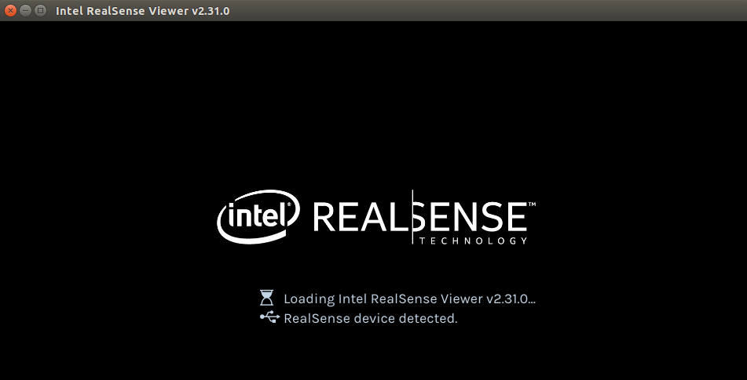
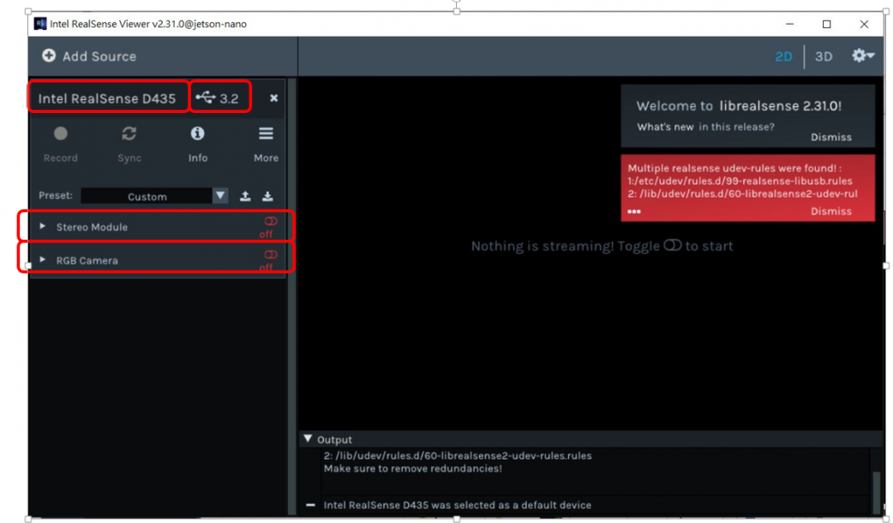
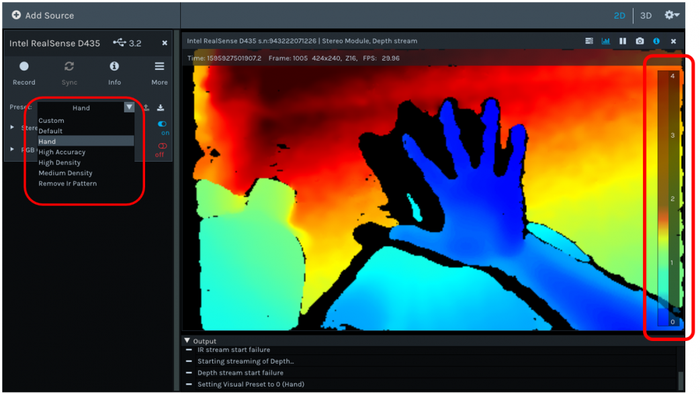

# 透過Jetson Nano 連接 intel Realsense D435i 進行目標偵測與測距

## 環境設定
### 請開啟terminal輸入以下操作指令，請注意，務必按照流程順序完成。

### 安裝Tensorflow Lite Runtime套件程式
影像目標偵測採用SSD Mobilenet V2版本的Tensorflow Lite預訓練模型，因此必須要事先安裝Tensorflow Lite Runtime套件，安裝流程如下：
```bash
pip3 install https://github.com/google-coral/pycoral/releases/download/release-frogfish/tflite_runtime-2.5.0-cp36-cp36m-linux_aarch64.whl
```

### 安裝Realsense支援套件。
#### Step1 安裝Swapfile提高JetsonNano記憶容量
解決Jetson Nano內部記憶體可能在安裝時不足的問題，使用在USB的隨身碟或SSD進行虛擬記憶體的操作，預設擴充的內存為6GB。
```bash
git clone https://github.com/jetsonhacksnano/installSwapfile
cd installSwapfile
./installSwapfile.sh
sudo reboot
```
#### Step2 安裝RealSense SDK。
這個SDK是以Intel RealSense提供的SDK做修改(https://github.com/IntelRealSense/librealsense)，支援Intel D400系列、T265、SR300的函式庫，
執行該指令，安裝Intel Intel Librealsense Debian Repository。
請注意，安裝時可能要輸入使用者密碼，且建立Librealsense Debian Repository，整個安裝時間可能需要30分鐘，請務必耐心等候。
```bash
git clone https://github.com/jetsonhacksnano/installLibrealsense
cd installLibrealsense
./installLibrealsense.sh
./buildLibrealsense.sh
```

#### Step3 安裝缺失的套件，且重新開機。
```bash
sudo apt-get install libcanberra-gtk-module libcanberra-gtk3-module
sudo reboot
```

### 以realsense-viewer應用程式測試 intel RealSense D435i
#### RealSense Viewer是RealSense SDK很方便的應用，它可以幫助使用者在開發程式之前，先確認這些事：
##### 1.確認RealSense型號
##### 2.裝置與RealSense 的USB版本
##### 3.確認RGB、深度、IR影像
##### 4.確認RGB與深度的影像整合畫面
##### 5.設定輸出像素、FPS、ROI與簡易的濾波

開啟terminal輸入以下指令，會顯示RealSense操作介面
```bash
realsense-viewer
```
#### realsense-viewer 的首頁歡迎畫面


#### 操作模式的介紹
接上RealSense D435，在螢幕左上角可以確認RealSense的型號，開發板連結RealSense的USB版本，可從Stereo Module的on/off 開關開啟深度資訊、RGB Camera則是一般的影像串流。


#### 操作測距模式
開啟【Stereo Module】，從【Preset】可以調整影像輸出的模式，以下圖為例，點選【Hand】模式，手指的輪廓可以更清晰呈現。畫面的影響顏色代表深度模組偵測的距離，右方有一個量表，量值的範圍為0~4公尺，分別用漸層的顏色來表示。我們可以看到圖中藍色的手部輪廓，離攝影機最近，約20~30公分，背後牆壁的部分離攝影機為兩公尺，D435的深度誤差為1~2公分。


