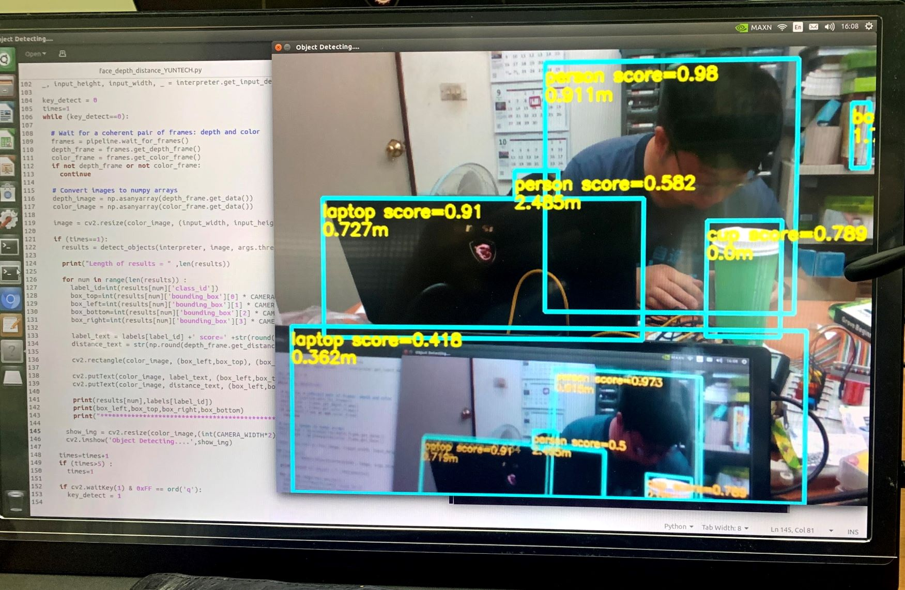
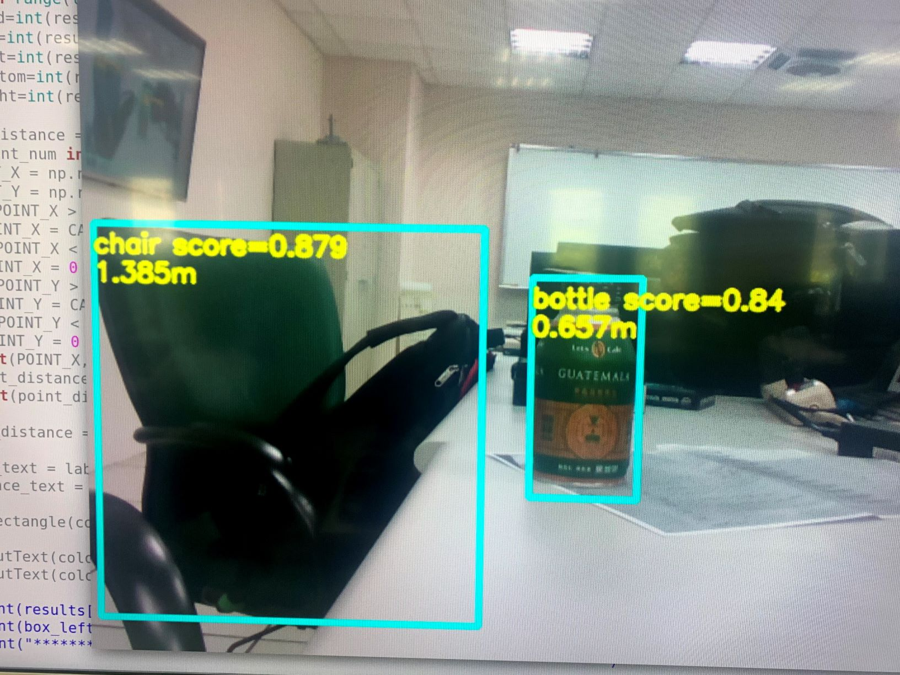
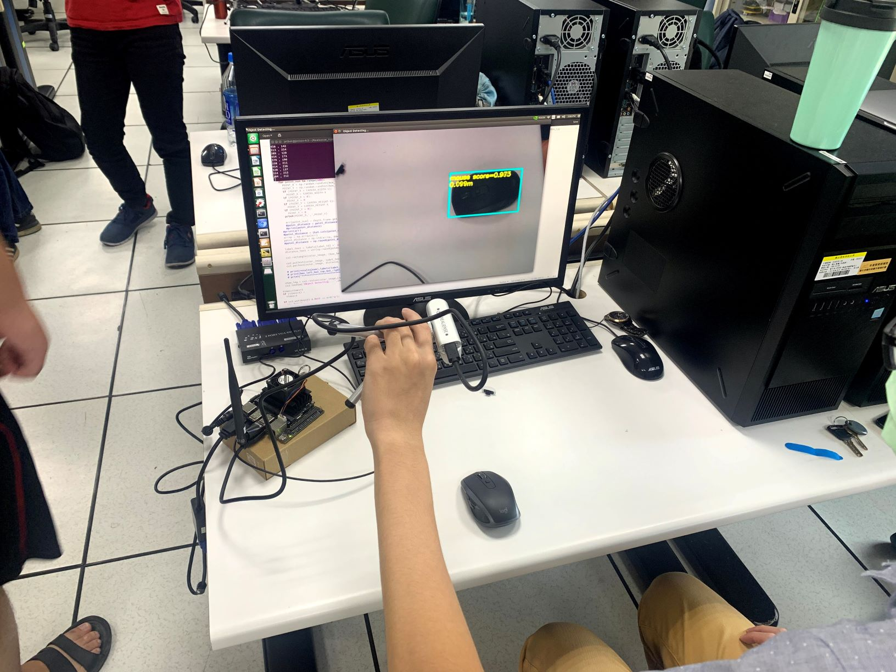

# 透過Jetson Nano 連接 intel Realsense D435i 進行目標偵測與測距

## 環境設定
### 請開啟terminal輸入以下操作指令，請注意，務必按照流程順序完成。

### 安裝Tensorflow Lite Runtime套件程式
影像目標偵測採用SSD Mobilenet V2版本的Tensorflow Lite預訓練模型，因此必須要事先安裝Tensorflow Lite Runtime套件，安裝流程如下：
```bash
pip3 install https://github.com/google-coral/pycoral/releases/download/release-frogfish/tflite_runtime-2.5.0-cp36-cp36m-linux_aarch64.whl
```

### 安裝Realsense支援套件。
#### Step1 安裝Swapfile提高JetsonNano記憶容量
解決Jetson Nano內部記憶體可能在安裝時不足的問題，使用在USB的隨身碟或SSD進行虛擬記憶體的操作，預設擴充的內存為6GB。
```bash
git clone https://github.com/jetsonhacksnano/installSwapfile
cd installSwapfile
./installSwapfile.sh
sudo reboot
```
#### Step2 安裝RealSense SDK。
這個SDK是以Intel RealSense提供的SDK做修改(https://github.com/IntelRealSense/librealsense)，支援Intel D400系列、T265、SR300的函式庫，
執行該指令，安裝Intel Intel Librealsense Debian Repository。
請注意，安裝時可能要輸入使用者密碼，且建立Librealsense Debian Repository，整個安裝時間可能需要30分鐘，請務必耐心等候。
```bash
git clone https://github.com/jetsonhacksnano/installLibrealsense
cd installLibrealsense
./installLibrealsense.sh
./buildLibrealsense.sh
```

#### Step3 安裝缺失的套件，且重新開機。
```bash
sudo apt-get install libcanberra-gtk-module libcanberra-gtk3-module
sudo reboot
```

### 以realsense-viewer應用程式測試 intel RealSense D435i
#### RealSense Viewer是RealSense SDK很方便的應用，它可以幫助使用者在開發程式之前，先確認這些事：
##### 1.確認RealSense型號
##### 2.裝置與RealSense 的USB版本
##### 3.確認RGB、深度、IR影像
##### 4.確認RGB與深度的影像整合畫面
##### 5.設定輸出像素、FPS、ROI與簡易的濾波

開啟Terminal輸入以下指令，會顯示RealSense操作介面
```bash
realsense-viewer
```
#### realsense-viewer 的首頁歡迎畫面


#### 操作模式的介紹
接上RealSense D435，在螢幕左上角可以確認RealSense的型號，開發板連結RealSense的USB版本，可從Stereo Module的on/off 開關開啟深度資訊、RGB Camera則是一般的影像串流。


#### 操作測距模式
開啟【Stereo Module】，從【Preset】可以調整影像輸出的模式，以下圖為例，點選【Hand】模式，手指的輪廓可以更清晰呈現。畫面的影響顏色代表深度模組偵測的距離，右方有一個量表，量值的範圍為0至4公尺，分別用漸層的顏色來表示。我們可以看到圖中藍色的手部輪廓，離攝影機最近，約20至30公分，背後牆壁的部分離攝影機為兩公尺，D435的深度誤差為1至2公分。


## 透過OBJECT_distance.py程式進行影像目標偵測並且測距
### 採用Tensorflow Lite的預訓練模型
請於執行程式之前，將預訓練模型檔mobilenet_ssd_v2_coco_quant_postprocess.tflite與標籤檔coco_labels.txt存放至與Python程式同一個目錄當中。
請開啟Terminal執行以下命令：
```bash
python3 OBJECT_distance.py\
--model mobilenet_ssd_v2_coco_quant_postprocess.tflite\
--labels coco_labels.txt
```
#### 參數說明：
##### --model 目標偵測預訓練模型檔，請注意!若使用本範例程式，務必使用Tensorflow Lite格式的模型。
相關預訓練模型，亦可以至Tensorflow官網查詢下載(https://www.tensorflow.org/lite/models)。
##### --labels 標籤檔，請注意!標籤檔的內容必須與「目標偵測預訓練模型檔」相互匹配。

### 程式運作原理：
##### 1.透過RGB影像進行物件偵測。
##### 2.物件邊界框對應到深度資訊相應的位置。
##### 3.在深度資訊的物件框範圍內進行隨機N點位置的測距並取出其N點距離的平均值。

### 程式重要片段說明

設定深度資訊與RGB影像的存取
```bash
# Configure depth and color streams
pipeline = rs.pipeline()
config = rs.config()
config.enable_stream(rs.stream.depth, CAMERA_WIDTH, CAMERA_HEIGHT, rs.format.z16, 30)
config.enable_stream(rs.stream.color, CAMERA_WIDTH, CAMERA_HEIGHT, rs.format.bgr8, 30)

# Start streaming
pipeline.start(config)
```

存取深度影像depth_frame資訊與RGB影像color_frame資訊
```bash
# Wait for a coherent pair of frames: depth and color
frames = pipeline.wait_for_frames()
depth_frame = frames.get_depth_frame()
color_frame = frames.get_color_frame()
if not depth_frame or not color_frame:
  continue
```

轉換成適用於OpenCV存取格式的深度影像depth_image資訊與RGB影像color_image資訊
```bash
# Convert images to numpy arrays
depth_image = np.asanyarray(depth_frame.get_data())
color_image = np.asanyarray(color_frame.get_data())
```

將RGB影像資訊調整成模型可接受的大小image
```bash
image = cv2.resize(color_image, (input_width, input_height))
```

透過 detect_objects 副函式將RGB影像image，進行目標偵測(Object Detection)。
```bash
results = detect_objects(interpreter, image, args.threshold)
```

以隨機探測取點的方式(共取500點)取其平均數進行距離的計算並將其存至point_distance變數中。
```bash
point_distance = 0.000
for point_num in range(500):
  POINT_X = np.random.randint(box_left,box_right)
  POINT_Y = np.random.randint(box_top,box_bottom)
  if (POINT_X > CAMERA_WIDTH-1):
    POINT_X = CAMERA_WIDTH-1
  if (POINT_X < 0):
    POINT_X = 0
  if (POINT_Y > CAMERA_HEIGHT-1):
    POINT_Y = CAMERA_HEIGHT-1
  if (POINT_Y < 0):
    POINT_Y = 0
  print(POINT_X,',',POINT_Y)
  point_distance = point_distance + depth_frame.get_distance(POINT_X, POINT_Y)
  print(point_distance)
point_distance = np.round(point_distance/500, 3)
```

### 執行畫面




